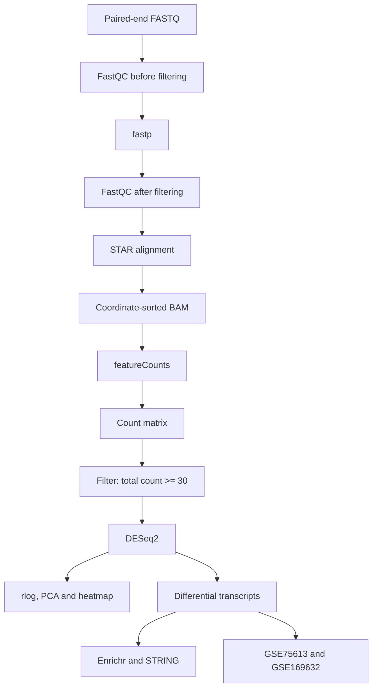

# Parental cocaine exposure - mature spermatozoon RNA cargo analysis

Bioinformatic workflow developed for the undergraduate thesis **"Caracterización bioinformática del cargo de ARN del espermatozoide maduro asociado a la exposición paterna a cocaína"**.

**Author:** Ian Franco Ghitarroni  
**Institution:** Universidad Argentina de la Empresa (UADE)  
**Thesis director:** Dra. Betina González  
**Co-director:** Dr. Juan Antonio Bizzotto

## Scope

This repository contains the code used to analyze the long-RNA/lncRNA-seq cargo of mature motile spermatozoa recovered from the cauda epididymis and selected by swim-up. It compares two pooled biological replicates from vehicle-treated animals (`A2`, `A3`) with two pooled biological replicates from cocaine-treated animals (`B3`, `B5`).

The thesis scope is restricted to RNA-seq analysis. RRBS and multi-omic integration are not part of this repository.

## Workflow



The computational stages are:

1. Raw paired-end FASTQ quality assessment with FastQC.
2. Adapter trimming and read filtering with fastp.
3. Post-filtering quality assessment with FastQC.
4. Alignment to the mouse reference genome GRCm39 using STAR.
5. BAM indexing with samtools.
6. Gene-level quantification with featureCounts and GENCODE vM33.
7. Removal of genes with fewer than 30 total counts across all four libraries.
8. DESeq2 normalization and differential representation analysis.
9. Regularized-logarithm transformation (`rlog`) for PCA and heatmaps.
10. Export of analysis-ready tables and manuscript-alignment checks.
11. Downstream biological interpretation using Enrichr, STRING, GSE75613 and GSE169632.

The primary statistical contrast is **cocaine versus vehicle**. Following the reference manuscript, transcripts are classified as differentially represented when `padj < 0.1` and `|log2FoldChange| > 1`, using the Benjamini-Hochberg adjustment implemented by DESeq2.

## Alignment with the reference manuscript

| Item | Implemented criterion |
|---|---|
| Minimum abundance | Total count across all samples >= 30 |
| Normalization | DESeq2 median-of-ratios method |
| Differential model | `~ condition` |
| Contrast | Cocaine versus Vehicle |
| Significance | `padj < 0.1` and `|log2FoldChange| > 1` |
| Multiple testing | Benjamini-Hochberg |
| PCA and heatmaps | `rlog(dds, blind = TRUE)` |
| Reference genome | GRCm39/mm39 |
| Annotation | GENCODE vM33 |
| Embryo translatome | GSE169632 |

The analysis writes `manuscript_result_check.csv`, which compares the observed result with the summary reported in the manuscript and Figure 3B:

- 75 differentially represented transcripts;
- 73 with lower representation and 2 with higher representation in the cocaine group;
- 71 coding and 4 non-coding transcripts.

A `REVIEW` result is a control signal. It does not alter or discard any transcript automatically.

## Repository structure

```text
.
├── config/
│   └── samples.example.csv
├── scripts/
│   ├── 00_generate_counts.sh
│   ├── 01_deseq2_analysis.R
│   └── 02_public_dataset_comparison.R
├── 02_QC/                  # generated locally; not versioned
├── results/                # generated locally; not versioned
├── .gitignore
└── README.md
```

## Pipeline provenance

The original local execution was divided into two shell scripts. One script performed trimming and STAR alignment for samples `A2`, `A3`, `B3` and `B5`; a second continuation script aligned any remaining trimmed reads and executed featureCounts. Both stages were consolidated into `scripts/00_generate_counts.sh` to preserve the complete route from paired FASTQ files to the count matrix consumed by R.

The consolidated script retains the effective parameters documented in the original workflow:

- paired-end fastp processing with automatic adapter detection;
- STAR coordinate-sorted BAM output;
- four processing threads by default;
- a 2 GB STAR BAM sorting memory limit;
- paired-end featureCounts quantification using `-p --countReadPairs`;
- exon-level assignment grouped by `gene_id`;
- GENCODE mouse vM33 annotation;
- samples `A2`, `A3`, `B3` and `B5`.

FastQC was added before and after fastp to retain the quality-control evidence requested for the thesis. For disk management, trimmed FASTQ files are removed only after successful BAM generation and post-filtering FastQC. Set `KEEP_TRIMMED=1` to retain them.

## Input requirements

The preprocessing script expects:

- paired FASTQ files under `00_RawData`, named `<sample>_R1.fastq.gz` and `<sample>_R2.fastq.gz`;
- a STAR index at `Ref_Genome_mm39/star_index`;
- `Ref_Genome_mm39/gencode.vM33.annotation.gtf`;
- `FastQC`, `fastp`, `STAR`, `samtools` and `featureCounts` available in `PATH`.

The R script expects:

- the featureCounts output containing gene-level integer counts;
- a sample metadata CSV based on `config/samples.example.csv`;
- the same GENCODE vM33 GTF used for quantification;
- R 4.5.1 or the validated analysis release;
- the packages listed below.

Raw FASTQ, BAM, genome indexes and unpublished primary data are intentionally excluded because of file size, provenance and publication constraints.

## Installation

```r
install.packages(c("tidyverse", "pheatmap", "ggrepel"))

if (!requireNamespace("BiocManager", quietly = TRUE)) {
  install.packages("BiocManager")
}

BiocManager::install(c(
  "DESeq2",
  "AnnotationDbi",
  "org.Mm.eg.db"
))

install.packages("ggwordcloud")
```

## Execution

Generate QC reports, align the reads and create the count matrix:

```bash
bash scripts/00_generate_counts.sh
```

Optional environment variables can override local resources and paths:

```bash
THREADS=8 BAM_SORT_RAM=4000000000 KEEP_TRIMMED=1 \
  bash scripts/00_generate_counts.sh
```

Run the statistical analysis:

```bash
Rscript scripts/01_deseq2_analysis.R \
  --counts 04_Counts/counts_matrix.txt \
  --metadata config/samples.csv \
  --gtf Ref_Genome_mm39/gencode.vM33.annotation.gtf \
  --output results
```

Reproduce the comparisons with GSE75613 and GSE169632 processed tables:

```bash
Rscript scripts/02_public_dataset_comparison.R \
  --de-results results/deseq2_significant_transcripts.csv \
  --gse75613-table data/table_sharma2016.csv \
  --gse169632-table data/translatome_embryo.csv \
  --output results/public_datasets
```

## Generated evidence

The preprocessing stage retains:

- raw-read FastQC HTML and ZIP reports;
- fastp HTML and JSON reports;
- post-filtering FastQC HTML and ZIP reports;
- STAR logs for each sample;
- the featureCounts assignment summary;
- `02_QC/software_versions.tsv` with command-line tool versions and reference identifiers.

The R stage exports:

- the complete and significant DESeq2 tables;
- a plain-text gene-symbol list for STRING and Enrichr;
- normalized counts;
- analysis parameters;
- PCA coordinates and an rlog-based PCA figure;
- a volcano plot using adjusted p-values;
- a heatmap containing all differentially represented transcripts;
- direction-by-biotype counts and figure;
- a manuscript result check;
- `sessionInfo.txt` with R and package versions.

The public-dataset stage exports the exact transcript overlaps, the reproductive-compartment heatmap, the embryo-translatome word cloud, a check against the reported 38 embryo-associated transcripts and its own R session information.

These files provide the evidence needed to document the FASTQ-processing section and the software-version table in the thesis. They must be generated on the original analysis workstation or another environment containing the authorized input data.

## Public reference datasets

- **GSE75613:** processed reproductive-cell and epididymal expression table used to examine the probable origin of cocaine-associated transcripts. The exact processed table and selected columns must be recorded with the final thesis outputs.
- **GSE169632:** one-cell embryo total and ribosome-associated RNA data used to identify transcripts compatible with early translational availability.

The embryo comparison does not establish exclusive paternal origin. It identifies sperm-borne transcripts also detected in the one-cell embryo translatome.

STRING and Enrichr remain platform analyses. Upload `results/functional_gene_symbols.txt` and record the access date, database release, organism, confidence setting, number of k-means clusters and downloaded result tables. This information is required to reproduce the reported PPI enrichment values and functional terms.

## Interpretation constraints

- The mature spermatozoon is not treated as a conventionally transcriptionally active cell. Results are described as changes in **RNA cargo representation**, not active gene expression.
- `n = 2` per condition corresponds to two independent pooled biological replicates; each pool was generated from six animals. It must not be interpreted as twelve independent RNA-seq observations.
- The workflow identifies statistical associations in the mature spermatozoon RNA cargo. It does not establish causality, paternal transmission or a specific offspring phenotype.
- Detection in one-cell embryo ribosome-associated fractions is compatible with early translational availability, but does not prove exclusive paternal origin.
- Biological interpretation must distinguish potential spermatogenic and epididymal contributions.

## Reproducibility and software versions

Every preprocessing run writes command-line tool versions to `02_QC/software_versions.tsv`. Every statistical run writes the complete R session information to `results/sessionInfo.txt`.

These generated files are the source of truth for software versions. The repository intentionally does not invent an `renv.lock` from a different computer. A lockfile should be created only from the validated workstation used to reproduce the final figures.

The pipeline has not been re-executed inside GitHub because the repository does not contain raw sequencing data, genome indexes or the GTF annotation.

## Data availability

This repository does not redistribute raw sequencing data or third-party datasets. Public reference datasets must be obtained from their original repositories under their respective terms. Analysis-ready inputs may be added only after confirming authorization, publication status and applicable repository limits.

## Citation

Until the associated thesis and manuscript receive their final bibliographic records, cite this repository using its GitHub URL, author, title and accessed commit hash.

## License and reuse

No open-source license has been assigned yet. Consequently, the code is publicly visible but no reuse rights are granted beyond those provided by applicable law. A license should be selected only after confirming the requirements of UADE, the research group and the associated manuscript.
